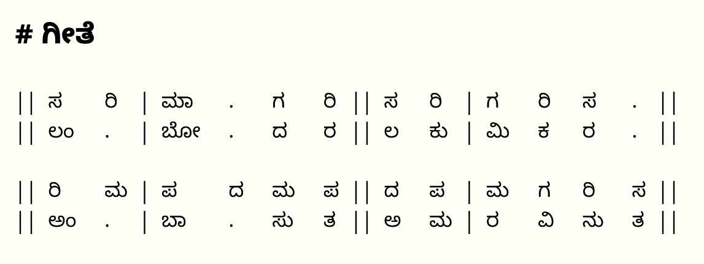

# Note-a-bhairavi

Make high-quality Carnatic music notation, with a focus on konnakol.

[Click here](https://ragumagu.dev/note-a-bhairavi/notation_app.html) to open the app.

## Examples:

In music notation, we have to align notes and syllables, laid out in a grid separated by | or ||.

However, in languages like Kannada, not all letters have the same width and letters cannot be aligned with spaces only, so you need a grid to align them.

|Without alignment | With alignment |
| --- | --- |
|  |  | 

With my app, you can get this using a simple input scheme:

    >Language: Kannada

    # GIte

    || sa ·ri | mA ·. ·ga ·ri || sa ·ri | ga ·ri ·sa ·. ||
    || lam ·. | bO ·. ·da ·ra || la ·ku | mi ·ka ·ra ·. ||
    · 
    || ri · ma | pa ·da · ma ·pa || da · pa | ma · ga · ri · sa ||
    || am · .  | bA· .  · su ·ta || a  · ma | ra · vi · nu · ta ||

With rhythmic notation, sometimes, it is useful to see
notes laid out in groups, instead of a grid.

To distinguish between a grid of notes and a grouping of notes, I use a pilcrow - ⁋.

|Without grouping | With grouping |
| --- | --- |
|  |  | 

You can do this with:

    >Language: kannada
    ># Korvai

    >:r
    ⁋ · (taka) dhim, tata dhim, ⁋
    ⁋ ta ·(taka) dhim, tata dhim, ⁋
    ⁋ ta, dhi,·(taka) dhim, tata dhim, ⁋
    ⁋ ·tadigiNatom ·ta ;; ^5^ ⁋
    ⁋ ·tadigiNatom ·ta ;; ^5^ ⁋
    ⁋ ·tadigiNatom ·  ⁋ 

Notice how you can type in English and get output text in multiple
languages quite easily. 

## Tutorial:

[Click here](https://ragumagu.dev/note-a-bhairavi/notation_app.html?content=tutorial) to go to the tutorial.

## Running locally:
To run this project locally, clone the project, and run with any http server;
for example:

    mkdir carnatic-notation
    cd carnatic-notation
    git clone https://github.com/ragumagu/note-a-bhairavi.git
    python -m http.server

## This is work in progress

This application lets you type in English, and generate notation in English, Kannada, Tamil, Telugu, Malayalam and Sanskrit. The transliteration feature is based on the work of Ramadorai Arunkumar (I hope this is correct) who has developed a [Carnatic Music Typesetter](http://arunk.freepgs.com/wordpress/cm-typesetter/about/) and [Unified Transliteration Scheme for Carnatic Music Compositions](http://arunk.freepgs.com/cmtranslit/cmtranslit_scheme.html).
